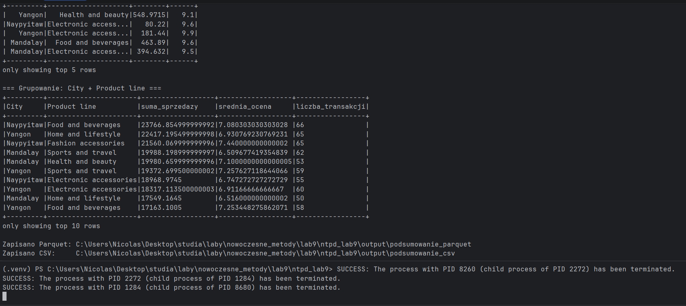
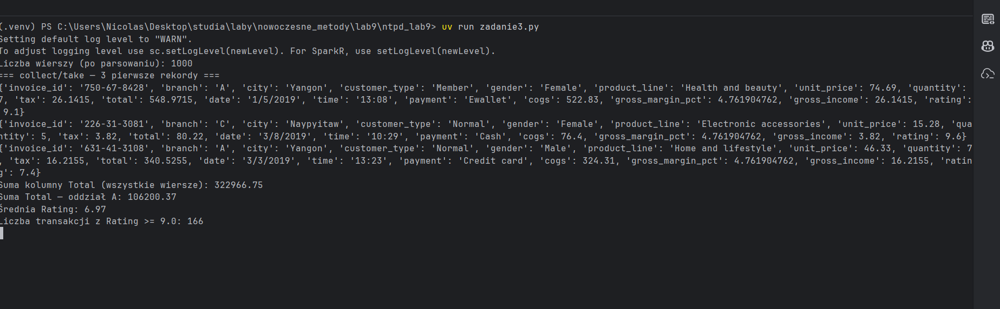

# Lab 9 - Apache Spark i PySpark

Opisuję realizację zadań z laboratorium **Nowoczesne metody przetwarzania danych** (lab 9). Projekt uruchamiam na Windowsie; Sparka mam jako lokalną instancję w **Dockerze**, a skrypty PySpark piszę w Pythonie z menedżerem **uv**.

## Środowisko

- **Python:** 3.11 (`uv`, plik `.python-version`)  
- **Java:** JDK 17 (Eclipse Adoptium) - wymagane do uruchamiania PySpark na hoście w trybie `local[*]`  
- **Spark:** 3.5.1 (obraz `apache/spark:3.5.1` w Docker Compose)  
- **PySpark:** 3.5.1 (`pyproject.toml`)

## Struktura projektu

| Plik / folder | Opis |
|---------------|------|
| `docker-compose.yml` | Klaster Spark (master + worker) |
| `data/supermarket_sales.csv` | Dane sprzedaży do Zadania 2 |
| `main.py` | Zadanie 2 - operacje na DataFrame |
| `zadanie3.py` | Zadanie 3 - operacje na RDD |
| `scripts/check_pyspark.py` | Krótki test PySpark |
| `scripts/run_local.ps1` | Uruchomienie `main.py` z JDK 17 |
| `scripts/run_cluster.ps1` | Uruchomienie `main.py` na klastrze Docker |
| `output/` | Wyniki zapisu (Parquet, CSV) |
| `screeny/zadanie2.png` | Zrzut ekranu z uruchomienia Zadania 2 |
| `screeny/zadanie3.png` | Zrzut ekranu z uruchomienia Zadania 3 |
| `tools/hadoop/` | `winutils.exe` - potrzebne do zapisu plików na Windows |

---

## Zadanie 1: Uruchomienie lokalnej instancji Apache Spark

### 1. Instalacja i konfiguracja Sparka

Zamiast instalować Sparka bezpośrednio na Windows (problemy z Javą 25, `winutils`, `HADOOP_HOME`), skonfigurowałem **lokalną instancję w Dockerze**:

```powershell
docker compose up -d
```

W `docker-compose.yml` uruchamiam:

- **spark-master** - porty `7077` (RPC), `8080` (Web UI),
- **spark-worker** - port `8081` (Web UI workera),

oraz montuję folder `./data` do `/opt/spark/data` w kontenerach.

Dodatkowo na hoście mam **JDK 17** i folder `tools/hadoop` z `winutils.exe`, żeby móc uruchamiać skrypty PySpark lokalnie (`uv run main.py`) bez błędów zapisu i bez konfliktu z Javą 25.

### 2. Test `spark-shell` i `pyspark`

Sprawdziłem obie powłoki w kontenerze Sparka (master `local[*]`):

**Scala - `spark-shell`:**

```powershell
docker compose run --rm spark-worker /opt/spark/bin/spark-shell --master "local[*]"
```

W powłoce wykonałem m.in.:

```scala
spark.range(5).count()
:quit
```

**Python - `pyspark`:**

```powershell
docker compose run --rm spark-worker /opt/spark/bin/pyspark --master "local[*]"
```

```python
spark.range(5).count()
exit()
```

Oba testy zakończyły się poprawnie - Spark odpowiada i wykonuje proste operacje.

Interfejs klastra sprawdzam w przeglądarce: http://localhost:8080 (master), http://localhost:8081 (worker).

### 3. Pakiet `pyspark` w środowisku Python

Dodałem zależność w `pyproject.toml`:

```toml
dependencies = ["pyspark==3.5.1"]
```

Instaluję pakiety poleceniem:

```powershell
uv sync
```

Dzięki temu mogę pisać skrypty PySpark w projekcie (np. `main.py`, `scripts/check_pyspark.py`) i uruchamiać je przez `uv run`.

Szybki test pakietu:

```powershell
uv run python scripts/check_pyspark.py
```

Skrypt tworzy `SparkSession` w trybie `local[*]`, liczy wiersze `spark.range(10)` i wyświetla wynik.

---

## Zadanie 2: Podstawowe operacje na DataFrame w PySpark

Realizuję w pliku **`main.py`**.

### 1. Plik CSV z danymi

Przygotowałem zestaw **supermarket_sales** - dane o sprzedaży w supermarketach (wiersze z m.in. oddziałem, miastem, linią produktową, ceną, ilością, sumą, oceną). Plik leży w:

```
data/supermarket_sales.csv
```

### 2. Wczytanie danych do DataFrame

Tworzę sesję Spark zgodnie z poleceniem i wczytuję CSV z nagłówkiem oraz automatycznym typem kolumn:

```python
spark = (
    SparkSession.builder
    .appName("DataFrameExample")
    .master("local[*]")
    .getOrCreate()
)

df = spark.read.csv(csv_path, header=True, inferSchema=True)
```

Na co dzień uruchamiam to poleceniem `uv run main.py` (tryb `local[*]` na hoście). Opcjonalnie mogę użyć klastra Docker: `.\scripts\run_cluster.ps1`.

### 3. Podstawowe operacje

W skrypcie wykonuję kolejno:

| Operacja | Co robię w kodzie |
|----------|-------------------|
| **Schemat i podgląd** | `df.printSchema()`, `df.show(10)` |
| **Selekcja kolumn** | `df.select("Invoice ID", "Branch", "City", "Product line", "Total", "Rating")` |
| **Filtrowanie** | `filter()` - oddział A i `Total > 500`; `where()` - `Rating >= 9.0` |
| **Grupowanie i agregacje** | `groupBy("City", "Product line").agg(sum(Total), avg(Rating), count(*))` |

Przykład agregacji:

```python
summary = df.groupBy("City", "Product line").agg(
    F.sum("Total").alias("suma_sprzedazy"),
    F.avg("Rating").alias("srednia_ocena"),
    F.count("*").alias("liczba_transakcji"),
)
summary.orderBy(F.desc("suma_sprzedazy")).show(10)
```

### 4. Zapis przetworzonego DataFrame

Wynik agregacji (`summary`) zapisuję do folderu `output/` w dwóch formatach:

- **Parquet:** `output/podsumowanie_parquet/`
- **CSV:** `output/podsumowanie_csv/` (jeden plik `part-00000-....csv`)

```python
summary.write.mode("overwrite").parquet(parquet_path)
summary.coalesce(1).write.mode("overwrite").option("header", True).csv(csv_path_out)
```

### Zrzut ekranu z uruchomienia

Poniżej wklejam zrzut z terminala po wykonaniu `uv run main.py` - widać m.in. tabelę po grupowaniu (`suma_sprzedazy`, `srednia_ocena`, `liczba_transakcji`) oraz komunikaty o zapisie plików Parquet i CSV.



Na screenie widać m.in.:

- sekcję **„Grupowanie: City + Product line”** z 10 wierszami wyników,
- potwierdzenie zapisu do `output\podsumowanie_parquet` i `output\podsumowanie_csv`.

---

## Zadanie 3: Praca z RDD w PySpark

Realizuję w pliku **`zadanie3.py`**. Korzystam z tego samego pliku `data/supermarket_sales.csv`, ale tym razem wczytuję go na **niższym poziomie abstrakcji** - jako RDD, a wiersze parsuję samodzielnie w Pythonie (bez `spark.read.csv`).

### 1. Wczytanie CSV jako RDD i parsowanie wierszy

Plik traktuję jako zbiór linii tekstu (`textFile`), a następnie mapuję każdą linię na słownik:

```python
lines_rdd = sc.textFile(csv_path)

records_rdd = (
    lines_rdd.filter(lambda line: line != header)
    .map(parse_line)
    .filter(lambda row: row is not None)
)
```

Funkcja `parse_line()` dzieli wiersz po przecinku (`split(",")`) i konwertuje pola numeryczne (`total`, `rating`, `quantity` itd.) na odpowiednie typy. Nagłówek odczytuję z pliku, żeby nie traktować go jako rekordu danych.

Na początku skryptu ustawiam też `PYSPARK_PYTHON` na interpreter z `.venv` - dzięki temu Spark nie próbuje używać Pythona 3.13 z Windows Store (przy RDD z lambda operacje na workerach wymagają zgodnej wersji Pythona).

### 2. Transformacje i akcje

W skrypcie ćwiczę podstawowe operacje na RDD:

| Typ | Operacje | Przykład w kodzie |
|-----|----------|-------------------|
| **Transformacje** | `map`, `filter` | `map(parse_line)`, `filter(branch == "A")`, `map(lambda r: r["total"])` |
| **Akcje** | `count`, `collect`, `take`, `reduce` | `records_rdd.count()`, `take(3)`, `reduce(lambda a, b: a + b)` |
| **Dodatkowo** | `reduceByKey`, `sortBy` | suma sprzedaży per miasto, top 5 transakcji |

Przykład sumowania kolumny `Total` funkcją `reduce`:

```python
sum_total = records_rdd.map(lambda r: r["total"]).reduce(lambda a, b: a + b)
```

Przykład grupowania po mieście (`reduceByKey`):

```python
city_sales = (
    records_rdd.map(lambda r: (r["city"], r["total"]))
    .reduceByKey(lambda a, b: a + b)
    .collect()
)
```

### 3. Zliczenia i podsumowania

Po uruchomieniu `uv run zadanie3.py` otrzymuję m.in.:

| Metryka | Wynik |
|---------|-------|
| Liczba wierszy (po parsowaniu) | **1000** |
| Suma kolumny `Total` (wszystkie wiersze) | **322 966,75** |
| Suma `Total` - oddział A | **106 200,37** |
| Średnia `Rating` | **6,97** |
| Liczba transakcji z `Rating >= 9.0` | **166** |
| Suma sprzedaży per miasto | Naypyitaw: 110 568,71 · Yangon: 106 200,37 · Mandalay: 106 197,67 |

Dodatkowo wyświetlam **3 pierwsze rekordy** (`take`) oraz **top 5 najwyższych transakcji** (`sortBy` + `take`).

### Zrzut ekranu z uruchomienia

Poniżej zrzut z terminala po `uv run zadanie3.py` - widać liczbę wierszy, przykładowe rekordy po parsowaniu oraz obliczone sumy i średnie.



Na screenie widać m.in.:

- `Liczba wierszy (po parsowaniu): 1000`,
- trzy pierwsze rekordy jako słowniki Pythona,
- sumę kolumny `Total`, sumę dla oddziału A, średnią `Rating` i liczbę transakcji z wysoką oceną.

---

## Jak uruchomić (skrót)

```powershell
# Zależności Python
uv sync

# Zadanie 1 - klaster Spark
docker compose up -d

# Zadanie 2 - skrypt z operacjami na DataFrame
uv run main.py
# lub:
.\scripts\run_local.ps1

# Zadanie 3 - operacje na RDD
uv run zadanie3.py

# Zatrzymanie klastra
docker compose down
```

---

*Laboratorium 9 - Apache Spark / PySpark*
